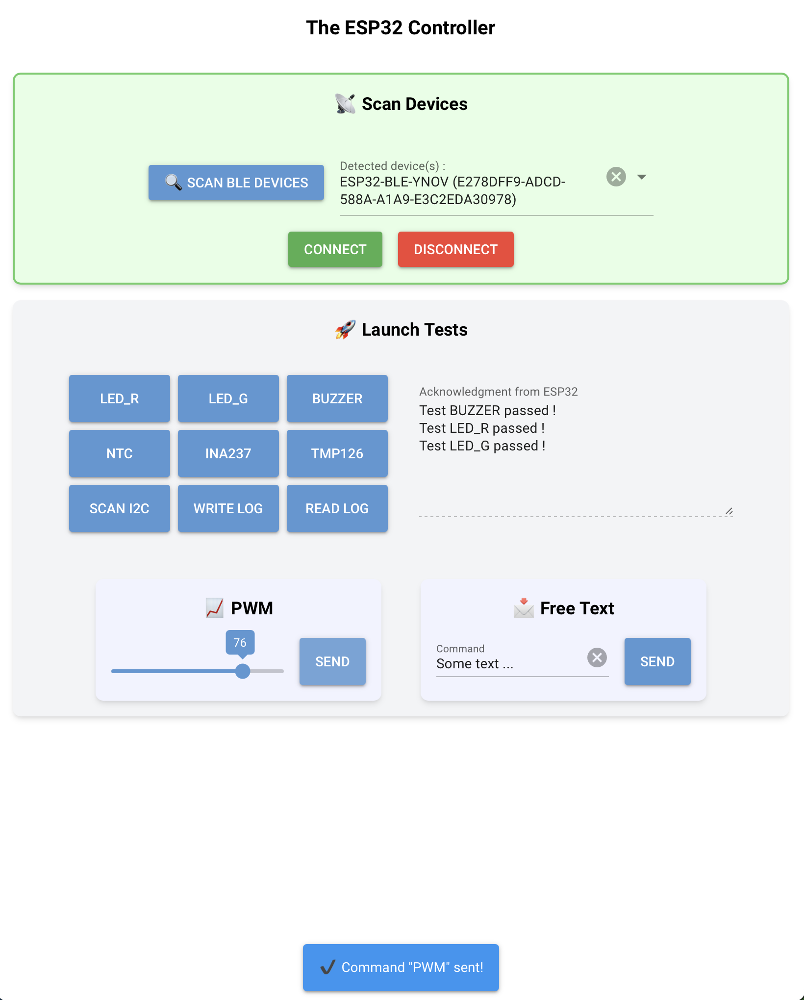

# TheESP32Controller
## 🧠 À propos

TheESP32Controller permet d’interagir avec une carte ESP32 depuis un ordinateur via **Bluetooth Low Energy (BLE)**, pour :

- Lancer des **tests unitaires à distance**
- Contrôler des fonctionnalités comme LED, buzzer, capteurs, communication I²C/SPI, etc.

Ce projet est à utiliser par les étudiants en Master 1 du cours de **Validation électronique** afin de vérifier et valider le fonctionnement de la communication sans fil BLE entre leurs cartes YNOV-DevBoard-v1 et leurs PC, et ainsi jouer l'ensemble des tests unitaires de leurs systèmes à distance.

## 🚀 Fonctionnalités principales

- Lancer les **tests unitaires/fonctionnels embarqués** sur la carte YNOV-DevBoard-v1 via BLE.
- Lire les **logs** produits dans `log.txt` stockés dans SPIFFS.
- Interagir avec des capteurs via une interface Python.

## 📦 Prérequis

- Carte **YNOV-DevBoard-v1**
- **VSCode** installé (ou autre IDE)
- Python 3

## 🏗️ Installation
### 1. Cloner le dépôt

```bash
git clone https://github.com/COURS-YNOV/TheESP32Controller.git
cd TheESP32Controller
```

### 2. Créer & activer un environnement virtuel

```bash
python3 -m venv .venv
source .venv/bin/activate
```

### 2. Installer les requirements

```bash
pip install -r requirements.txt
```

### 3. Lancer l'application

```bash
python src/main.py
```

## 🚶‍♂️ Utilisation de l’application Python

1. Lancer l'application : ```python src/main.py```
2. Scan des devices BLE actifs : (```Scan devices```)
3. Sélection du device souhaité, et connexion (```Connect```)
    - Une fois le device connecté, une notification apparaît en bas de la fenêtre et le fond de la zone **Scan Devices** passe vert. Les commandes de la zon **Launch Tests** deviennent alors clickable.
3. Activation des commandes :  
   - **LED_R** : Commande de test pour l'activation de la LED rouge.
   - **LED_G** : Commande de test pour l'activation de la LED verte.
   - **BUZZER** : Commande de test pour l'activation du buzzer.
   - **INA** : Commande de test pour récupération des données de consommation en courant mesurées par l'INA.
   - **NTC** : Commande de test pour récupération des données de température mesurées par les CTN.
   - **TEMP** : Commande de test pour récupération de la donnée de température mesurée par le capteur TMP126.
   - **WRITE LOG** : Commande de test pour récupération de la donnée de température mesurée par le capteur TMP126.
   - **READ LOG** : Commande de test pour récupération de la donnée de température mesurée par le capteur TMP126.
   - **PWM_XXX** : Commande de test pour récupération de la donnée de température mesurée par le capteur TMP26.

## 📋 TODO

- Ajouter un handler de déconnexion de la carte.
- Implémenter des tests de performance.

## Explications :

- **`pytest`** : Framework de test pour exécuter des tests automatisés en Python.  
- **`pytest-asyncio`** : Permet de tester des fonctions asynchrones (`async def`) avec `pytest`.  
- **`unittest.mock`** : Sert à simuler des objets ou comportements, comme des périphériques BLE.  
- **`pytest.ini`** : Configure `pytest` pour reconnaître le dossier `src/` comme racine du projet.  
- **`__init__.py`** : Indique que le dossier est un module Python pour permettre les imports.  

## Application : 

